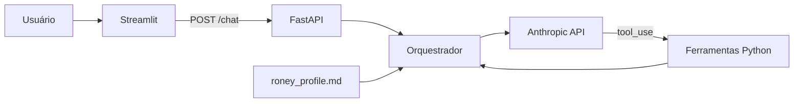

# Gêmeo Digital do Roney

> Assistente conversacional de portfólio com FastAPI, Streamlit, contexto profissional local e tool use via Anthropic.

## Visão geral

O projeto transforma um perfil profissional em uma experiência conversacional. O backend carrega `backend/data/roney_profile.md` no contexto do agente, expõe uma API tipada e executa ferramentas Python quando solicitadas pelo modelo. A interface Streamlit mantém o histórico da conversa e consome a API local.

## Capacidades verificadas

- API FastAPI com contratos Pydantic para mensagem, histórico e resposta;
- interface Streamlit com histórico em `session_state`;
- contexto profissional carregado de Markdown local;
- integração direta com o SDK da Anthropic;
- ciclo de `tool_use` com resumo de stack e status demonstrativo do GitHub;
- tratamento explícito para chave ausente e base de conhecimento indisponível.

> O arquivo profissional é inserido integralmente no prompt. Não há banco vetorial, chunking, embeddings ou busca por similaridade; portanto, este projeto demonstra grounding por contexto local, não RAG vetorial. A ferramenta de GitHub retorna dados demonstrativos definidos no código e não consulta a API pública.

## Arquitetura



## Stack

| Camada | Tecnologias |
| --- | --- |
| Backend | Python, FastAPI, Pydantic, Uvicorn |
| Frontend | Streamlit, Requests |
| IA | Anthropic SDK e tool use |
| Configuração | `python-dotenv`, `ANTHROPIC_API_KEY` |

## Estrutura

```text
backend/
  data/roney_profile.md
  agent.py
  main.py
  tools.py
frontend/app.py
requirements.txt
```

## Como executar

Pré-requisitos: Python 3.10+ e chave válida da Anthropic.

```bash
git clone https://github.com/RoneyPDN/gemeo_digital_roney.git
cd gemeo_digital_roney
python -m venv .venv
python -m pip install -r requirements.txt
```

Crie `.env` local — nunca versione esse arquivo:

```env
ANTHROPIC_API_KEY=sua_chave_local
```

Em terminais separados:

```bash
python -m uvicorn backend.main:app --reload --port 8000
python -m streamlit run frontend/app.py
```

- API: `http://localhost:8000`
- OpenAPI: `http://localhost:8000/docs`
- Streamlit: normalmente `http://localhost:8501`

## API

| Método | Rota | Finalidade |
| --- | --- | --- |
| `GET` | `/` | verificação simples da API |
| `POST` | `/chat` | envia mensagem e histórico ao agente |

## Limitações

- Requer serviço externo da Anthropic e pode gerar custo.
- O login da interface é uma verificação fixa no frontend; não é autenticação de produção.
- Não há persistência, RBAC, auditoria ou telemetria de tokens/custo.
- As tools têm conteúdo demonstrativo, não dados em tempo real.
- Não foram encontrados testes automatizados ou configuração de deploy.
- Confirme se o modelo definido no código está disponível para sua conta Anthropic.

## Próximas evoluções

- autenticação server-side e gestão segura de sessão;
- testes de API e tool routing com provedor mockado;
- telemetria de latência, tokens, custo e falhas;
- versionamento de prompts e avaliações;
- adapter real de GitHub, claramente identificado.

## Status

Projeto de demonstração local. Este README não afirma deploy público ou prontidão para produção.

